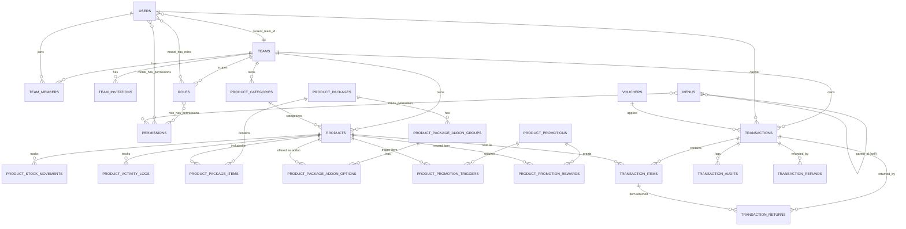

# 04. Database Schema

Dokumen ini mendeskripsikan struktur database aplikasi berdasarkan seluruh file migration yang ada di `database/migrations/`. Aplikasi ini adalah sistem **multi-tenant** (berbasis `team_id`) dengan modul utama: autentikasi & RBAC, katalog produk (termasuk paket/bundling dengan addon), promosi, dan transaksi POS (point of sale) lengkap dengan refund/return.

## Daftar Isi

- [1. Konvensi Umum](#1-konvensi-umum)
- [2. Entity Relationship Diagram](#2-entity-relationship-diagram)
- [3. Autentikasi & Sistem Inti](#3-autentikasi--sistem-inti)
- [4. Teams (Multi-Tenancy)](#4-teams-multi-tenancy)
- [5. RBAC — Roles & Permissions](#5-rbac--roles--permissions)
- [6. Menu & Navigasi](#6-menu--navigasi)
- [7. Katalog Produk](#7-katalog-produk)
- [8. Paket Produk & Addon](#8-paket-produk--addon)
- [9. Promosi (Buy X Get Y)](#9-promosi-buy-x-get-y)
- [10. Transaksi POS](#10-transaksi-pos)
- [11. Refund & Return](#11-refund--return)
- [12. Inventori & Audit Trail](#12-inventori--audit-trail)
- [13. Notifikasi](#13-notifikasi)
- [14. Catatan Desain](#14-catatan-desain)

---

## 1. Konvensi Umum

- **Multi-tenancy**: hampir semua tabel domain bisnis memiliki kolom `team_id` yang merujuk ke tabel `teams`. Ini adalah strategi *shared database, shared schema* — setiap query data bisnis wajib di-scope berdasarkan `team_id`.
- **Primary key**: mayoritas tabel menggunakan `bigIncrements` (`id`), kecuali `notifications` yang menggunakan `uuid`, dan beberapa tabel pivot/legacy (`password_reset_tokens`, `sessions`, `cache`, `cache_locks`, `job_batches`) yang menggunakan string sebagai primary key.
- **Soft delete**: hanya digunakan pada tabel `teams`. Tabel lain melakukan hard delete atau menonaktifkan record via flag `is_active`.
- **Foreign key style**: campuran antara `foreignId()->constrained()` (Laravel modern style) dan `unsignedBigInteger()` + `$table->foreign()` manual (style lama). Tidak konsisten — lihat [Catatan Desain](#14-catatan-desain).
- **Polymorphic reference pattern**: beberapa tabel log/movement menggunakan pasangan kolom `reference_type` + `reference_id` (bukan `morphs()` bawaan Laravel) untuk menghubungkan record ke entitas pemicu (misal: transaksi, stock adjustment manual, dll).
- **Money fields**: seluruh nilai uang disimpan sebagai `decimal(15,2)` atau `decimal(12,2)`.

---

## 2. Entity Relationship Diagram

> Diagram di atas tidak memuat tabel sistem bawaan Laravel (`sessions`, `cache`, `jobs`, dll) karena tidak relevan dengan relasi bisnis.

---

## 3. Autentikasi & Sistem Inti

### `users`

Tabel pengguna standar Laravel, diperluas dengan two-factor authentication dan keanggotaan tim.

| Kolom | Tipe | Keterangan |
|---|---|---|
| `id` | bigIncrements | PK |
| `name` | string | |
| `email` | string | unique |
| `email_verified_at` | timestamp | nullable |
| `password` | string | |
| `current_team_id` | foreignId → `teams.id` | nullable, `nullOnDelete` — tim aktif user saat ini |
| `two_factor_secret` | text | nullable |
| `two_factor_recovery_codes` | text | nullable |
| `two_factor_confirmed_at` | timestamp | nullable |
| `remember_token` | string | |
| `timestamps` | | |

### `password_reset_tokens`
PK `email`, kolom `token`, `created_at`. Standar Laravel.

### `sessions`
PK `id` (string). Kolom `user_id` (nullable, index), `ip_address`, `user_agent`, `payload`, `last_activity` (index). Standar Laravel — digunakan jika `SESSION_DRIVER=database`.

### `cache` & `cache_locks`
PK `key` (string). Standar Laravel — digunakan jika `CACHE_STORE=database`. `cache_locks` mendukung `Cache::lock()` untuk distributed locking.

### `jobs`, `job_batches`, `failed_jobs`
Standar Laravel queue (`QUEUE_CONNECTION=database`). Tidak ada kustomisasi.

---

## 4. Teams (Multi-Tenancy)

### `teams`
| Kolom | Tipe | Keterangan |
|---|---|---|
| `id` | bigIncrements | PK |
| `name` | string | |
| `slug` | string | unique |
| `is_personal` | boolean | default `false` |
| `timestamps`, `softDeletes` | | satu-satunya tabel dengan soft delete |

### `team_members`
Pivot keanggotaan user ↔ team dengan role string bebas (bukan FK ke tabel `roles`).

| Kolom | Tipe | Keterangan |
|---|---|---|
| `team_id` | foreignId → `teams` | cascade delete |
| `user_id` | foreignId → `users` | cascade delete |
| `role` | string | |

Constraint unik: `(team_id, user_id)`.

### `team_invitations`
| Kolom | Tipe | Keterangan |
|---|---|---|
| `code` | string(64) | unique, token undangan |
| `team_id` | foreignId → `teams` | cascade delete |
| `email` | string | |
| `role` | string | |
| `invited_by` | foreignId → `users` | cascade delete |
| `expires_at`, `accepted_at` | timestamp | nullable |

---

## 5. RBAC — Roles & Permissions

Dibangun di atas **Spatie `laravel-permission`** dengan fitur *teams* diaktifkan, dan diperluas dengan kolom metadata tambahan (`label`, `description`, `module`, `is_system`).

### `permissions`
| Kolom | Tipe | Keterangan |
|---|---|---|
| `id` | bigIncrements | PK |
| `name` | string | |
| `guard_name` | string | |
| `label`, `description`, `module` | string/nullable | metadata kustom untuk tampilan UI |

Unique: `(name, guard_name)`.

### `roles`
| Kolom | Tipe | Keterangan |
|---|---|---|
| `id` | bigIncrements | PK |
| `team_id` | unsignedBigInteger, nullable | FK → `teams`, cascade delete — role bisa global (`null`) atau scoped per tim |
| `name`, `guard_name` | string | |
| `label`, `description` | string/nullable | metadata kustom |
| `is_system` | boolean | default `false` — menandai role bawaan sistem yang tidak boleh dihapus user |

Unique: `(team_id, name, guard_name)`.

### `model_has_permissions` / `model_has_roles`
Pivot polymorphic standar Spatie (`model_type` + `model_id`), **ditambah `team_id`** (nullable) sebagai bagian dari composite primary key — wajib ada karena `config('permission.teams')` diaktifkan.

### `role_has_permissions`
Pivot sederhana `permission_id` ↔ `role_id`, composite PK.

> Setelah seluruh tabel permission dibuat, migration ini juga memanggil `app('cache')->forget(...)` untuk membersihkan cache permission Spatie.

---

## 6. Menu & Navigasi

### `menus`
Struktur menu sidebar dinamis, mendukung nested menu via self-referencing FK.

| Kolom | Tipe | Keterangan |
|---|---|---|
| `name` | string | unique, identifier internal |
| `label` | string | teks tampilan |
| `route` | string | nullable |
| `icon` | string | nullable |
| `parent_id` | unsignedBigInteger, nullable | FK → `menus.id`, cascade delete |
| `sort_order` | integer | default `0` |
| `is_active` | boolean | default `true` |
| `module` | string | nullable |

### `menu_permission`
Pivot menu ↔ permission — satu menu hanya tampil jika user memiliki permission yang terhubung. Unique: `(menu_id, permission_id)`.

---

## 7. Katalog Produk

### `product_categories`
| Kolom | Tipe | Keterangan |
|---|---|---|
| `team_id` | unsignedBigInteger, index | FK → `teams`, cascade delete |
| `name` | string | unique (global, bukan per-tim — perlu diverifikasi apakah ini disengaja) |
| `description` | text, nullable | |
| `is_active` | boolean | default `true` |

### `products`
| Kolom | Tipe | Keterangan |
|---|---|---|
| `team_id` | unsignedBigInteger, index | FK → `teams`, cascade delete |
| `category_id` | unsignedBigInteger, nullable | FK → `product_categories`, `nullOnDelete` |
| `sku` | string | unique |
| `name` | string | |
| `description` | text, nullable | |
| `price` | decimal(15,2) | harga jual |
| `cost` | decimal(15,2), nullable | harga modal |
| `stock` | integer | default `0` |
| `min_stock` | integer | default `0` — ambang batas stok minimum |
| `is_active` | boolean | default `true` |

---

## 8. Paket Produk & Addon

Modul bundling — satu paket terdiri dari beberapa item produk dasar, dengan opsi *addon group* (slot yang bisa ditukar, misal "Pilihan Minuman").

### `product_packages`
| Kolom | Tipe | Keterangan |
|---|---|---|
| `team_id` | foreignId → `teams` | cascade delete |
| `category_id` | foreignId → `product_categories`, nullable | `nullOnDelete` |
| `sku` | string | unique |
| `name`, `description` | | |
| `base_price` | decimal(12,2) | harga dasar paket |
| `is_active` | boolean | default `true` |

Index: `(team_id, is_active)`.

### `product_package_items`
Item produk yang otomatis termasuk dalam paket.

| Kolom | Tipe | Keterangan |
|---|---|---|
| `package_id` | foreignId → `product_packages` | cascade delete |
| `product_id` | foreignId → `products` | cascade delete |
| `quantity` | unsignedInteger | default `1` |
| `note` | string, nullable | contoh: *"ayam bagian paha atas"* |

### `product_package_addon_groups`
Mendefinisikan satu "slot" yang dapat ditukar dalam paket.

| Kolom | Tipe | Keterangan |
|---|---|---|
| `package_id` | foreignId → `product_packages` | cascade delete |
| `name` | string | contoh: *"Pilihan Minuman"* |
| `default_product_id` | foreignId → `products`, nullable | `nullOnDelete` — item default yang sudah termasuk paket |
| `is_required` | boolean | default `false` — wajib pilih satu opsi |
| `sort_order` | unsignedTinyInteger | default `0` |

### `product_package_addon_options`
Daftar produk alternatif yang bisa dipilih sebagai pengganti `default_product_id` dalam satu addon group.

| Kolom | Tipe | Keterangan |
|---|---|---|
| `addon_group_id` | foreignId → `product_package_addon_groups` | cascade delete |
| `product_id` | foreignId → `products` | cascade delete |
| `extra_charge` | decimal(12,2) | default `0` — `0` = tukar gratis, `>0` = biaya tambahan |
| `sort_order` | unsignedTinyInteger | default `0` |

---

## 9. Promosi (Buy X Get Y)

### `product_promotions`
| Kolom | Tipe | Keterangan |
|---|---|---|
| `team_id` | foreignId → `teams` | cascade delete |
| `name`, `description` | | contoh nama: *"Beli Ayam 2 Gratis 1"* |
| `type` | string | default `'bxgy'` — dirancang agar bisa diperluas ke tipe lain (`discount`, `bundle`, dll) |
| `is_active` | boolean | default `true` |
| `starts_at`, `ends_at` | date, nullable | `null` = tidak dibatasi waktu |

Index: `(team_id, type, is_active)`.

### `product_promotion_triggers`
Syarat pembelian agar promosi aktif. Satu promosi dapat memiliki lebih dari satu trigger (logika AND).

| Kolom | Tipe | Keterangan |
|---|---|---|
| `promotion_id` | foreignId → `product_promotions` | cascade delete |
| `product_id` | foreignId → `products` | cascade delete |
| `min_quantity` | unsignedInteger | minimal jumlah beli |

### `product_promotion_rewards`
Hadiah yang diberikan ketika syarat trigger terpenuhi.

| Kolom | Tipe | Keterangan |
|---|---|---|
| `promotion_id` | foreignId → `product_promotions` | cascade delete |
| `product_id` | foreignId → `products` | cascade delete |
| `quantity` | unsignedInteger | jumlah yang didapat |
| `extra_charge` | decimal(12,2) | default `0` — `0` = gratis penuh, `>0` = diskon sebagian |

---

## 10. Transaksi POS

### `vouchers`
| Kolom | Tipe | Keterangan |
|---|---|---|
| `team_id` | unsignedBigInteger, index | FK → `teams`, cascade delete |
| `code` | string | unik per tim |
| `name` | string | |
| `type` | string | default `'fixed'` (vs persentase, dsb.) |
| `value` | decimal(15,2) | nilai diskon |
| `min_purchase` | decimal(15,2) | default `0` |
| `max_discount` | decimal(15,2), nullable | batas maksimum diskon (untuk tipe persentase) |
| `usage_limit` | unsignedInteger, nullable | |
| `used_count` | unsignedInteger | default `0` |
| `starts_at`, `expires_at` | timestamp, nullable | |
| `is_active` | boolean | default `true` |

Unique: `(team_id, code)`.

### `transactions`
Header transaksi penjualan.

| Kolom | Tipe | Keterangan |
|---|---|---|
| `team_id` | unsignedBigInteger, index | FK → `teams`, cascade delete |
| `user_id` | unsignedBigInteger, nullable, index | FK → `users` (kasir), `nullOnDelete` |
| `voucher_id` | unsignedBigInteger, nullable, index | FK → `vouchers`, `nullOnDelete` |
| `invoice_number` | string | unique |
| `customer_name` | string, nullable | |
| `status` | string(32) | default `'pending'` |
| `payment_status` | string(32) | default `'unpaid'` |
| `payment_method` | string(32), nullable | |
| `subtotal` | decimal(15,2) | |
| `discount_total` | decimal(15,2) | default `0` |
| `tax_total` | decimal(15,2) | default `0` |
| `grand_total` | decimal(15,2) | |
| `paid_amount` | decimal(15,2) | default `0` |
| `change_amount` | decimal(15,2) | default `0` |
| `note` | text, nullable | |
| `paid_at` | timestamp, nullable | |

### `transaction_items`
Baris item dalam satu transaksi. Menyimpan snapshot nama/SKU/harga produk pada saat transaksi (denormalisasi, agar histori tidak berubah jika data produk diedit kemudian).

| Kolom | Tipe | Keterangan |
|---|---|---|
| `transaction_id` | unsignedBigInteger, index | FK → `transactions`, cascade delete |
| `product_id` | unsignedBigInteger, nullable, index | FK → `products`, `nullOnDelete` |
| `item_type` | string(32) | default `'product'` — ditambahkan via migration susulan; nilai lain kemungkinan `'package'` |
| `item_reference_id` | unsignedBigInteger, nullable | merujuk ke `product_packages.id` ketika `item_type = 'package'` (referensi polymorphic manual, bukan FK constraint) |
| `product_name`, `product_sku` | string | snapshot nama/SKU saat transaksi |
| `unit_price` | decimal(15,2) | |
| `quantity` | unsignedInteger | |
| `discount_total` | decimal(15,2) | default `0` |
| `line_total` | decimal(15,2) | |

Index tambahan: `(item_type, item_reference_id)`.

> **Catatan**: kolom `item_type`/`item_reference_id` ditambahkan setelah tabel awal dibuat (lihat migration `2026_05_21_...`) untuk mendukung penjualan **paket produk**, bukan hanya produk tunggal. `product_id` tetap dipertahankan kemungkinan untuk kompatibilitas mundur atau sebagai representasi produk utama pada item bertipe `package`.

---

## 11. Refund & Return

### `transaction_refunds`
Refund pada level transaksi (uang dikembalikan, tidak melibatkan pengembalian barang).

| Kolom | Tipe | Keterangan |
|---|---|---|
| `team_id`, `transaction_id`, `user_id` | unsignedBigInteger, index | FK → `teams` / `transactions` (cascade) / `users` (`nullOnDelete`) |
| `refund_number` | string | unique |
| `amount` | decimal(15,2) | |
| `method` | string(32) | default `'cash'` |
| `status` | string(32) | default `'approved'` |
| `reason` | text, nullable | |
| `refunded_at` | timestamp, nullable | |

### `transaction_returns`
Return pada level item (barang dikembalikan, opsional masuk kembali ke stok).

| Kolom | Tipe | Keterangan |
|---|---|---|
| `team_id`, `transaction_id`, `transaction_item_id`, `product_id`, `user_id` | unsignedBigInteger, index | FK terkait, lihat di bawah |
| `return_number` | string | unique |
| `quantity` | unsignedInteger | |
| `refund_amount` | decimal(15,2) | default `0` |
| `restock` | boolean | default `true` — apakah otomatis menambah stok kembali |
| `status` | string(32) | default `'approved'` |
| `reason` | text, nullable | |
| `returned_at` | timestamp, nullable | |

FK: `team_id` → `teams` (cascade), `transaction_id` → `transactions` (cascade), `transaction_item_id` → `transaction_items` (cascade), `product_id` → `products` (`nullOnDelete`), `user_id` → `users` (`nullOnDelete`).

---

## 12. Inventori & Audit Trail

### `product_stock_movements`
Mencatat setiap perubahan stok produk (penjualan, restock manual, return, dll).

| Kolom | Tipe | Keterangan |
|---|---|---|
| `team_id`, `product_id` | unsignedBigInteger, index | FK → `teams` (cascade) / `products` (cascade) |
| `user_id` | unsignedBigInteger, nullable, index | FK → `users`, `nullOnDelete` |
| `type` | string(32) | jenis pergerakan (in/out/adjustment, dll) |
| `quantity` | unsignedInteger | default `0` |
| `stock_before`, `stock_after` | integer | snapshot stok sebelum & sesudah |
| `note` | text, nullable | |
| `reference_type`, `reference_id` | string/unsignedBigInteger, nullable | menghubungkan ke entitas pemicu (misal transaksi) — pola morph manual |

Index tambahan: `(reference_type, reference_id)`.

### `product_activity_logs`
Log aktivitas umum terhadap entitas produk/kategori (create/update/delete), terpisah dari `product_stock_movements` yang khusus stok.

| Kolom | Tipe | Keterangan |
|---|---|---|
| `team_id` | unsignedBigInteger, index | FK → `teams`, cascade delete |
| `user_id` | unsignedBigInteger, nullable, index | FK → `users`, `nullOnDelete` |
| `subject_type` | string(64) | jenis entitas (misal `Product`, `ProductCategory`) |
| `subject_id`, `subject_name` | unsignedBigInteger/string, nullable | identitas & snapshot nama subjek |
| `action` | string(32) | |
| `changes` | json, nullable | diff perubahan |
| `note` | text, nullable | |
| `reference_type`, `reference_id` | nullable | |

Index tambahan: `(subject_type, subject_id)`, `(reference_type, reference_id)`.

### `transaction_audits`
Audit trail khusus transaksi (untuk kepatuhan/keamanan — misal mencatat siapa yang membatalkan/mengubah transaksi, dari IP mana).

| Kolom | Tipe | Keterangan |
|---|---|---|
| `transaction_id` | foreignId → `transactions` | cascade delete |
| `team_id` | foreignId → `teams` | cascade delete |
| `user_id` | foreignId → `users`, nullable | `nullOnDelete` |
| `action` | string | |
| `changes` | json, nullable | |
| `ip_address` | string(45), nullable | |
| `user_agent` | text, nullable | |

---

## 13. Notifikasi

### `notifications`
Tabel standar Laravel `Notifiable` (database channel).

| Kolom | Tipe | Keterangan |
|---|---|---|
| `id` | uuid | PK |
| `type` | string | kelas notifikasi |
| `notifiable_type`, `notifiable_id` | morphs | target penerima |
| `data` | text | payload JSON terenkode string |
| `read_at` | timestamp, nullable | |

---

## 14. Catatan Desain

Beberapa hal yang perlu diperhatikan tim saat mengembangkan lebih lanjut:

1. **Inkonsistensi gaya foreign key.** Migration lama (`products`, `vouchers`, `transactions`, dll) memakai `unsignedBigInteger()` + `$table->foreign()` manual, sedangkan migration baru (`product_packages`, `product_promotions`, `transaction_audits`) memakai `foreignId()->constrained()`. Secara fungsi sama, tapi sebaiknya diseragamkan untuk migration berikutnya agar lebih mudah dibaca.
2. **Polymorphic manual vs `morphs()` bawaan.** Tabel log (`product_stock_movements`, `product_activity_logs`) menggunakan pasangan `reference_type`/`reference_id` atau `subject_type`/`subject_id` secara manual tanpa foreign key constraint (karena menunjuk ke tabel yang bervariasi). Ini disengaja — pastikan validasi integritas referensial dilakukan di level aplikasi/model (misal lewat observer atau service layer), karena database tidak akan mencegah referensi yang rusak.
3. **`item_reference_id` pada `transaction_items` juga tidak punya FK constraint** dengan alasan yang sama (bisa menunjuk ke `products` atau `product_packages` bergantung pada `item_type`). Disarankan ada validasi di Eloquent model (misal accessor/relasi morphTo manual) agar konsisten.
4. **`product_categories.name` bersifat unique secara global**, bukan per `team_id`. Ini kemungkinan tidak disengaja mengingat seluruh tabel lain konsisten men-scope keunikan per tim (lihat `vouchers` yang unique per `(team_id, code)`). Perlu dikonfirmasi ke tim — jika ini bug, perlu migration tambahan untuk mengubah unique constraint menjadi `(team_id, name)`.
5. **RBAC mendukung role global maupun role per tim** (`roles.team_id` nullable). Permission assignment (`model_has_roles`, `model_has_permissions`) juga mengikutsertakan `team_id` sehingga user bisa memiliki role berbeda di tim berbeda — penting untuk dipahami saat membangun middleware otorisasi (`Spatie\Permission` perlu di-set context tim aktif, biasanya via `setPermissionsTeamId()`, sebelum query permission dijalankan).
6. **Denormalisasi disengaja** pada `transaction_items` (`product_name`, `product_sku`) dan `transaction_returns`/`transaction_refunds` (snapshot jumlah) — ini pola umum di sistem POS agar histori transaksi tidak berubah retroaktif ketika data master produk diedit/dihapus.
7. **Soft delete hanya pada `teams`.** Jika ke depan dibutuhkan soft delete pada `products` atau `transactions` (misal untuk keperluan audit "produk yang dihapus tapi masih dirujuk transaksi lama"), perlu migration tambahan — saat ini menghapus produk yang masih dirujuk transaksi lama akan men-set `product_id` menjadi `null` (`nullOnDelete`), bukan mempertahankan record.

---

*Dokumen ini dihasilkan berdasarkan isi seluruh file di `database/migrations/` per tanggal migration terakhir `2026_05_29`. Perbarui dokumen ini setiap kali ada migration baru yang mengubah skema.*
